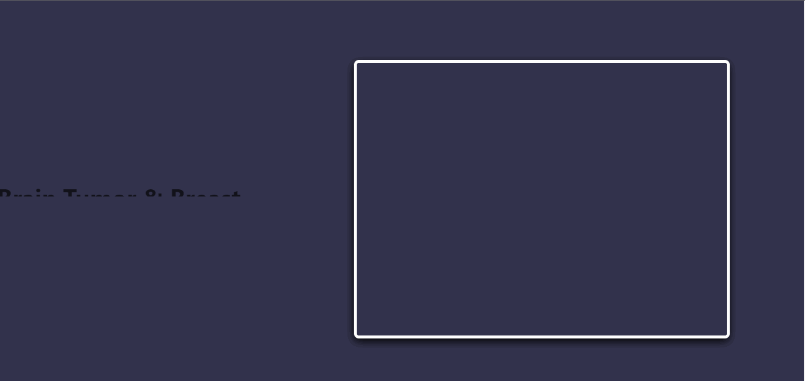

# Brain-Tumor & Brest-Cancer Detection

> **`Brain-Tumor & Brest-Cancer Detection`** is a web application that uses machine learning to detect if the user has a brain tumor. It also detects whether or not a patient has breast cancer.
This project was created with [Python](https://www.python.org/downloads/) version 3.8.

## User Stories

The following **required** functionality is completed:
- [x]  The user can upload an image generated by Magnetic Resonance Imaging (MRI).
- [x]  The user can get a prediction from the provided image.
- [x]  The user can enter the medical characteristics of a breast and obtain a prediction relating to the given characteristics.

## Video Walkthrough

Here's a walkthrough of implemented user stories:

GIF created with `LiceCap`.

## Development server

* Install Python
* Clone repository.
* Navigate to the project folder using the command line and run `pip install -r requirements.txt`.
* unzip the `models.zip` folder.
* Run the code for a dev server. Navigate to `http://localhost:5000/`. The application will automatically reload if you change any of the source files.

## Open-source ressources used

* Scikit-learn
* TensorFlow
* Flask
* Kaggle
* Numpy
* Pandas
* Matplotlib
* Seaborn

## License

    Copyright [2023] [UEspoir]

